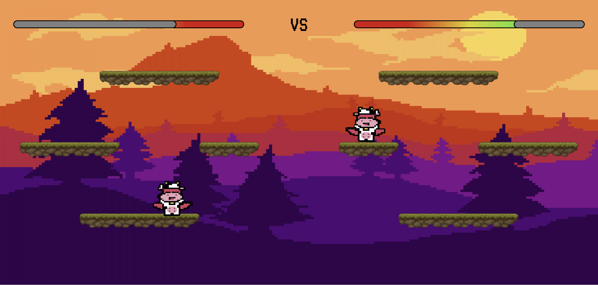

# [PROJECT]

# Creation of a combat game - html, css, js

This game is an offline combat game where two players can fight each other using the same computer. The goal is to deal 100 damages or more to the ennemy. Eventually, several characters with their own skin and attacks will be available.

## How to move ?

|    **Moves**    | **PLayer 1  (Start on the Left)** | **Player 2  (Start on the Right)** |
|:---------------:|---------------------|----------------------|
|       Left      |          <kbd>q</kbd>           |          <kbd>ArrowLeft</kbd>            |
|      Right      |          <kbd>d</kbd>           |          <kbd>ArrowRight</kbd>            |
|       Jump      |          <kbd>z</kbd>           |          <kbd>ArrowUp</kbd>            |
|  Primary Attack |          <kbd>space</kbd>           |          <kbd>KeyPad1</kbd>            |
| Ultimate Attack |          <kbd>a</kbd>           |          <kbd>KeyPad2</kbd>            |

## How to deal damages ?

At the moment, the only attack available is the primary. It deals 5 damages and is close-range.

More characters and attacks are to come in the future stages of the development.